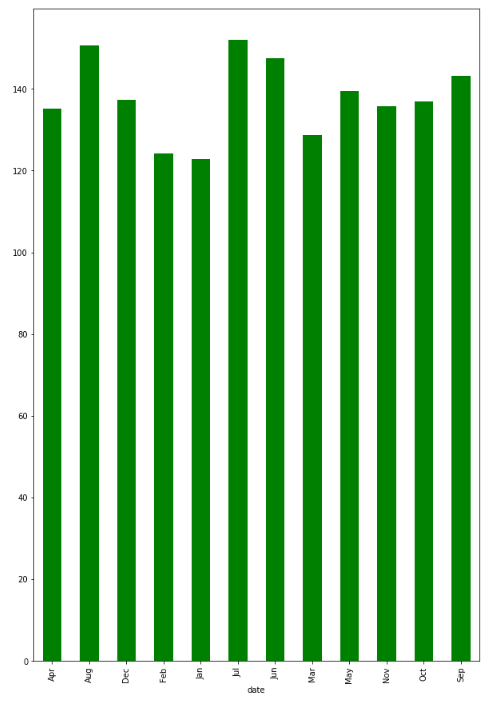
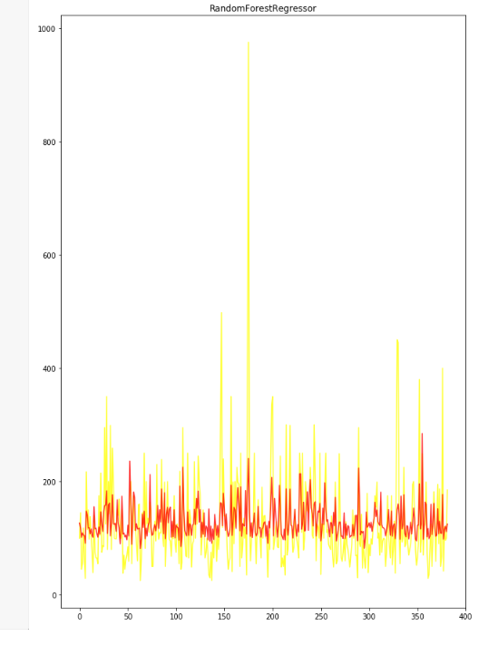

# Machine Learning Model-Based House Price Prediction 

## Data Sources：

The Seattle housing price dataset is sourced from：[Seattle Airbnb Open Data (kaggle.com)](https://www.kaggle.com/datasets/airbnb/seattle/data)

## Question raising

* How To Be a Super Host?
* How the Price/Night Change Over the Year in Seattle?
* Can we Predict Property Price/Night in Seattle Using Machine Learning Model ?

## Q1. How To Be a Super Host ?

* Next, we will start from the host_ Is_ Analyze the problem based on the relationship between super and three characteristics

* By drawing a host_ Is_ Superhost and Room_ Type bar chart analysis

* Draw host_ Is_ Superhost and host_ Response_ Conditional graph analysis of time

* Draw host_ Is_ Superhost and number_ Of_ Review the box diagram for analysis

* From the first picture, it can be seen that the type of room has little to do with whether it is a super landlord, and there should be as few open rooms as possible.
* From the second graph, it can be seen that landlords with shorter response times are more likely to become super landlords
* From the third chart, it can be seen that the more comments there are, the more positive reviews there are, and the probability of becoming a super landlord will significantly increase

## Q2. How The Price/Night Change Over The Year in Seattle ?

* Make a bar chart to analyze the changes in price within a year

* By analyzing the bar chart, it can be seen that rent is highest during summer and continues to decline after that until the end of winter

## Q3. Can We Predict Property Price/Night in Seattle Using Machine Learning Model?

* Solving the problem of housing price prediction by building a random forest model, using grid search method to search for hyperparameters, and k-fold cross validation to ensure the robustness of the model
* Below is a scatter plot of the model's predictions and the actual data

* It is possible to predict housing prices, but the results are not very good. It may be due to the selection and optimization of models, and the data is relatively limited

## Summarize

* This article addresses three issues in total

* Firstly, from the first question, we can see that there are three main factors for becoming a super landlord:
  1. More is better evaluation
  2. The type of room
  3. Fast response time
* Secondly, the second question shows that during the summer, the rent is relatively high
* Finally, the third question is that although we can predict housing prices, the effect is not very good
* You can find that big data is closely related to things in life. Let's learn about big data related knowledge
