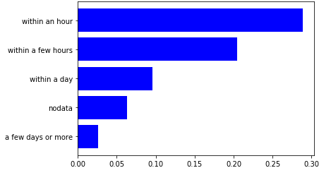

# Machine Learning Model-Based House Price Prediction - Data Processing


## 1.Data Sources：

The Seattle housing price dataset is sourced from：[Seattle Airbnb Open Data (kaggle.com)](https://www.kaggle.com/datasets/airbnb/seattle/data)

## 2.Data Processing

### Introduction to Data Processing

* The upper limit of the model is determined by data, and data processing takes up almost half of the effort in a complete case
* It is divided into two parts: data analysis and data cleaning
* Data analysis mainly includes: viewing data content, attributes, number of non null values, self analysis of attributes, correlation between attributes, and the level of correlation between attributes and predicted target values. Next, I will give a few examples to demonstrate

### Data Viewing

```python
# Show Seattle dataset columns details
df.info()
```


```python
df.describe()
```



### Handling Missing Values

#### 1.View Missing Values

* Use the isnull function to view missing values

```python
# Check which features have missing values
df.isnull().sum().sort_values(ascending=False)
```


#### 2.Missing Value Fixed Value Padding

* Using the fillna function to fill in missing values

```python
# Missing values are padded as fixed values
df.host_response_time.fillna('nodata', inplace=True)
df.host_response_time.value_counts()
```


#### 3.Filling In The Average Missing Value

* Fill in the average using SimpleImputer

```python
# Missing values are replaced by means
df_room = ['beds', 'bedrooms', 'bathrooms']
df[df_room] = SimpleImputer().fit_transform(df[df_room])
```


#### 4.Missing Value Mode Padding

* Using the for loop and mode function to fill in the mode

```python
# Missing values are replaced by the mode
df_review = ['review_scores_rating', 'review_scores_accuracy', 'review_scores_cleanliness', 'review_scores_checkin','review_scores_communication','review_scores_location','review_scores_value']
for i in df_review:
    df[i]=df[i].fillna(df[i].mode()[0])
```

#### 5.Delete Rows With Missing Values

* Use dropna to delete rows with missing values

```python
# Missing Values: Deletes the row where the missing value is located 
df_host=['host_since', 'host_identity_verified', 'property_type', 'host_is_superhost']
df.dropna(subset = df_host, inplace=True)
```

## 3.Summarize

* Data processing is of utmost importance for the entire analysis process. Only when data processing is done well can data analysis proceed smoothly
* There are many methods for handling missing values, but this article only provides a few examples. Other methods can be commented on in the comments section, let's learn together
